# Dify.ai on Amazon Lightsail

## 日本語

[こちらの記事](https://note.com/sangmin/n/nbb4db69784e8) (by サンミンさん [@gijigae](https://x.com/gijigae/status/1781938880574615626))で紹介されている
[Dify](https://github.com/langgenius/dify)のAWSへのデプロイ方法を，
AWS CDKを使ってコード化したものです．

AWSのマネジメントコンソールを使った場合と同等のリソース作成操作を，コマンドラインを使って実行しています．
インフラリソースをCDKでコード化してデプロイすることで，

- 途中の一部操作（SSHキーを作成してインスタンスにログインし，Difyインストールコマンドを実行する）が不要
- リソースが不要になった場合，CloudFormationのページから一括削除できる

などの利点があります．

AWS CDK（やその中でつかっているAWS CLI）を全く触ったことがない方も，AWS CloudShellという機能（これは完全無料！）を使えば，
CLIツールの面倒なインストール作業なしに，以下の手順で簡単にデプロイできます．

1. AWS CloudShellの起動

AWSアカウントにログインし，使用したいリージョンに切り替えてください．

それから，画面の右上のボタンを押して，CloudShellを開いてください．

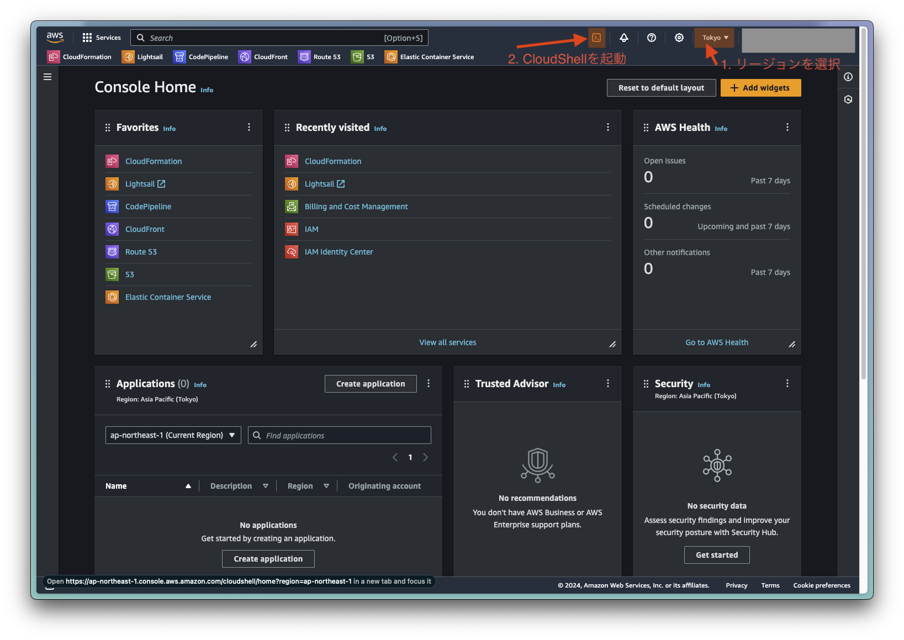

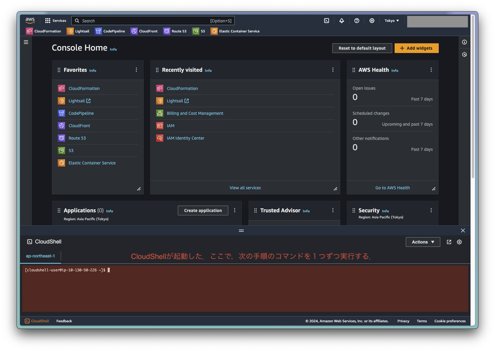


2. デプロイコマンドの実行

CloudShellのコンソールで，下記のコマンドを１行ずつ実行する．

```sh
git clone https://github.com/rikrikurik/cdk-dify-on-lightsail.git
cd cdk-dify-on-lightsail
npm i
cdk bootstrap
cdk deploy
```

3. 8 - 10分ほど待つ

（この間に，作成したインスタンスで，Dockerのインストール・DifyのGitHubコードpullとサービス起動が行われています．）

4. 出来上がったLightsailインスタンスの固定IPアドレスを確認して，ブラウザからDifyのフロントエンドにアクセスする．

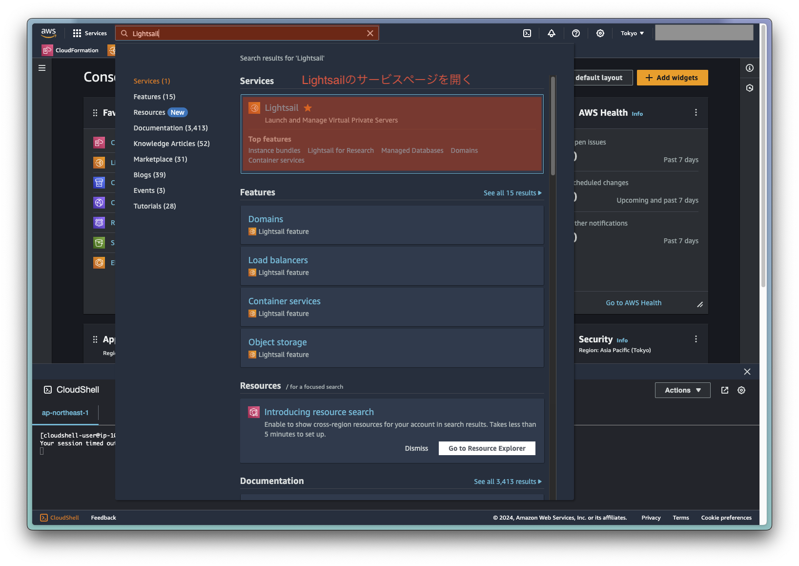

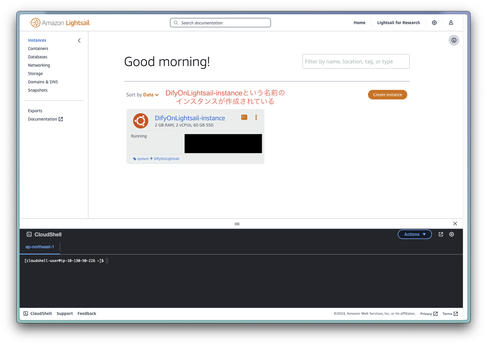

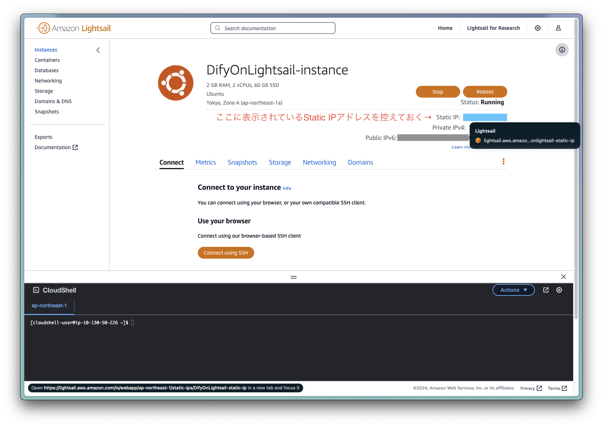

ブラウザで，[http://AAA.BBB.CCC.DDD](http://AAA.BBB.CCC.DDD)にアクセスする．
(AAA.BBB.CCC.DDDの部分は，先の手順で控えた固定IPアドレスに読み替え．)

**`https`ではなく`http`でのアクセスが必要なので注意する！**

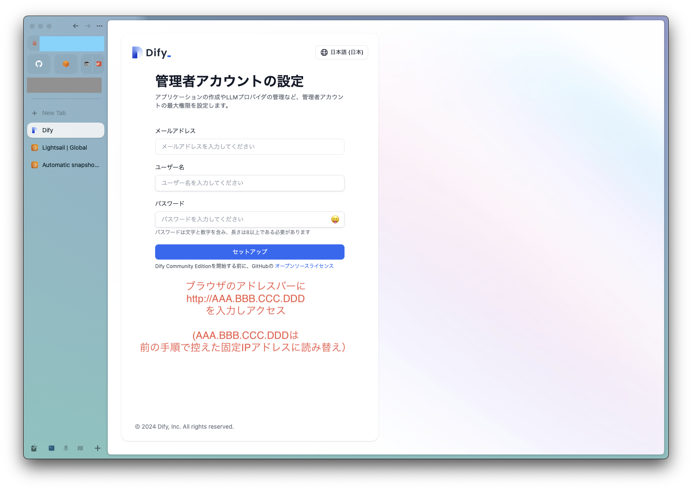

### 不要になった時のリソース削除方法

1. CloudFormationのページを開く.

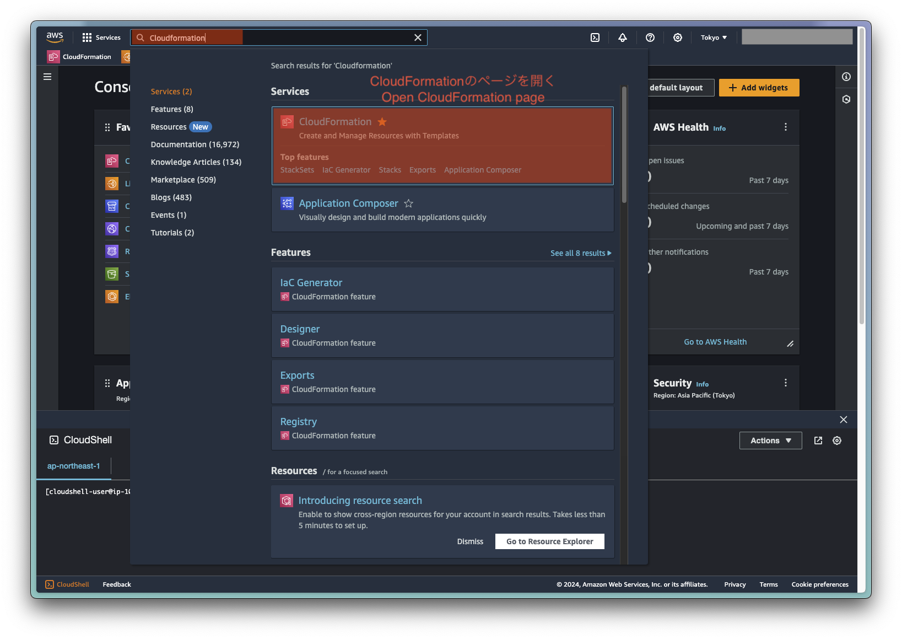

2. `DifyOnLightsail-stack`という名前のスタックを削除する

１度目の削除操作で，削除が失敗する（IPアドレスは削除されるが，Lightsailインスタンスが残ってしまう）事があるようなので，そのときは，再度削除操作をしてみてください．

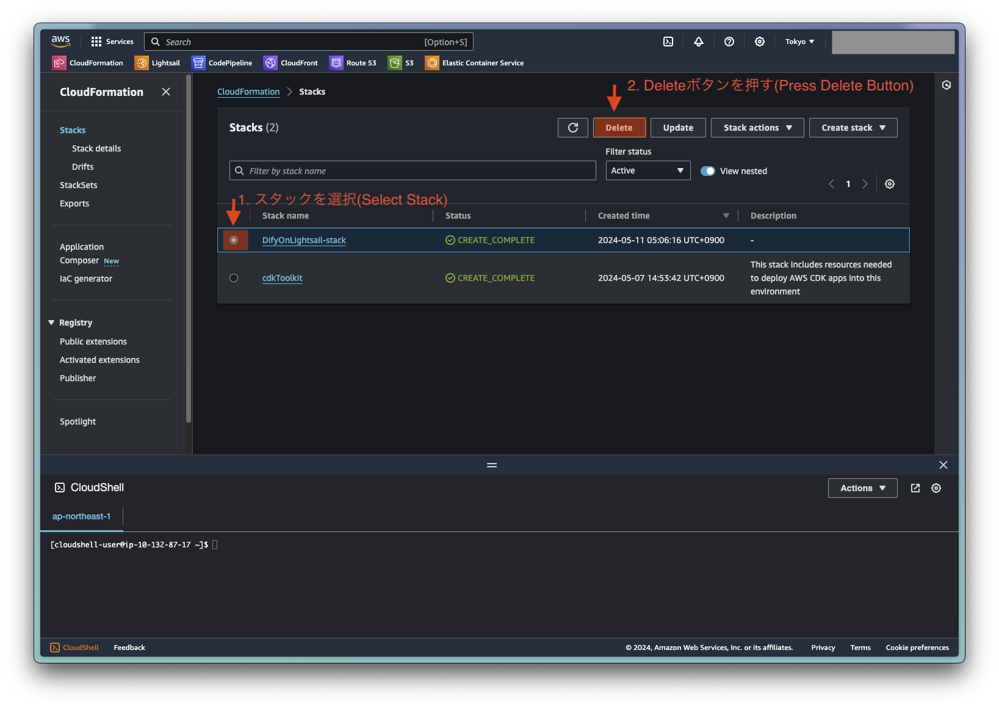

## English

This is AWS CDK project to deploy stack to install [Dify](https://github.com/langgenius/dify) on Amazon Lightsail, inspired by [this article (Japanese only)](https://note.com/sangmin/n/nbb4db69784e8) (by [@gijigae](https://x.com/gijigae/status/1781938880574615626)).

This project executes the same resource creation operations as using the AWS Management Console, but via the command line.
By codifying and deploying infrastructure resources with CDK, there are benefits such as:

- Some intermediate operations (creating SSH keys, logging into instances, and executing Dify installation commands) are unnecessary
- When resources are no longer needed, they can be deleted in bulk from the CloudFormation page

Don't worry that if you are not familiar with AWS CDK (or AWS CLI).

You can deploy this stack simply by using AWS CloudShell (free service!).

Here is an instruction to deploy this stack.

1. Open the AWS CloudShell.

Login to your AWS account and switch region to where you want to deploy this stack.

After that, click the CloudShell icon on the top right of the screen.

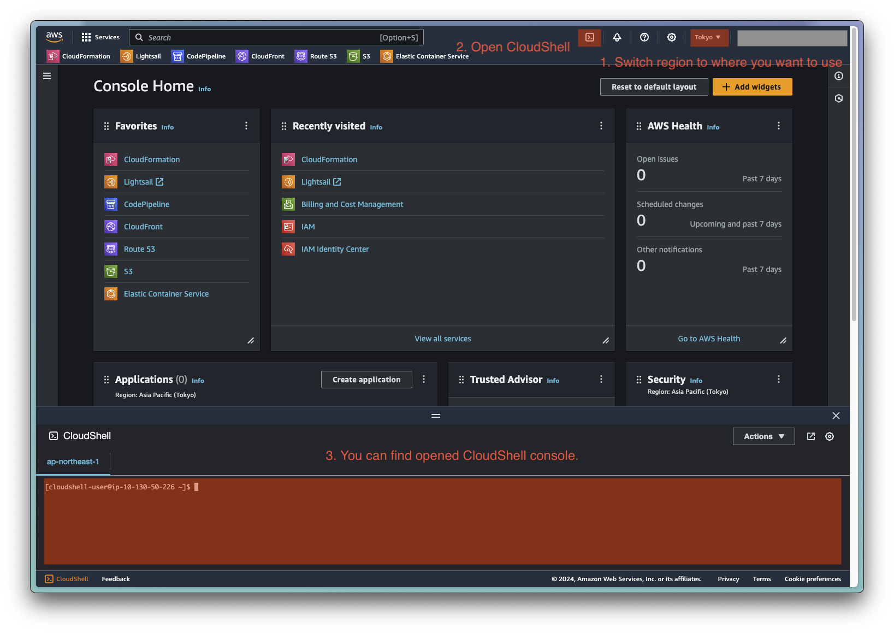

2. Execute CDK Deploy Command on CloudShell

Execute the following commands one line at a time.

```sh
git clone https://github.com/rikrikurik/cdk-dify-on-lightsail.git
cd cdk-dify-on-lightsail
npm i
cdk bootstrap
cdk deploy
```

3. Wait for 8 -10 minutes

(During this time, Docker installation, pulling Dify's GitHub code, and service startup are being performed on the created instance.)

4. Check the static IP address of the created Lightsail instance and access Dify's frontend from your browser.

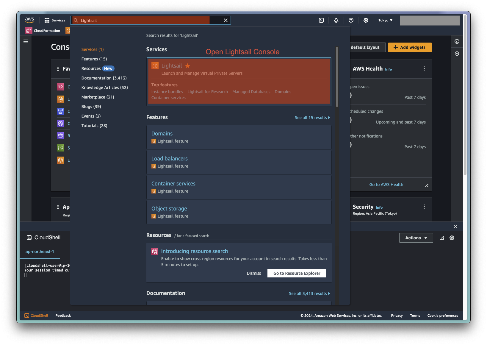

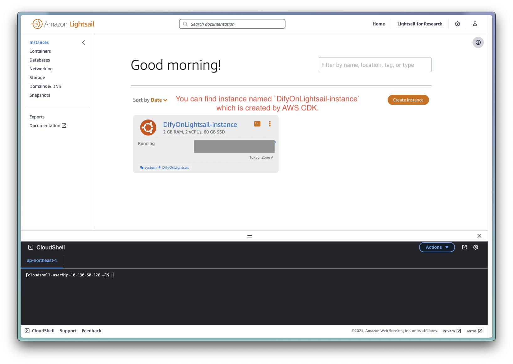

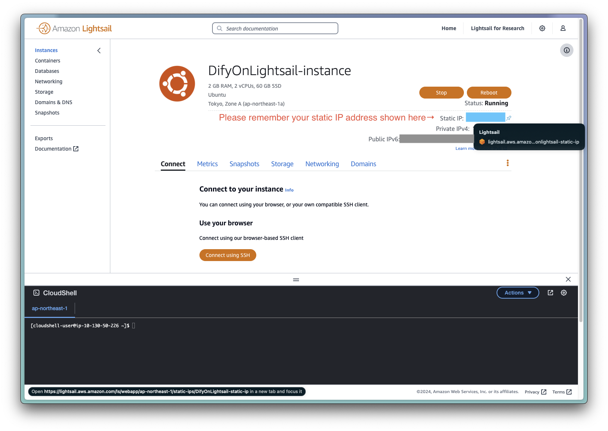

Access [http://AAA.BBB.CCC.DDD](http://AAA.BBB.CCC.DDD) from your browser.

(Please replace AAA.BBB.CCC.DDD to your static IP address of Lightsail instance.)

**Note that you should use `http` instead of `https`！**

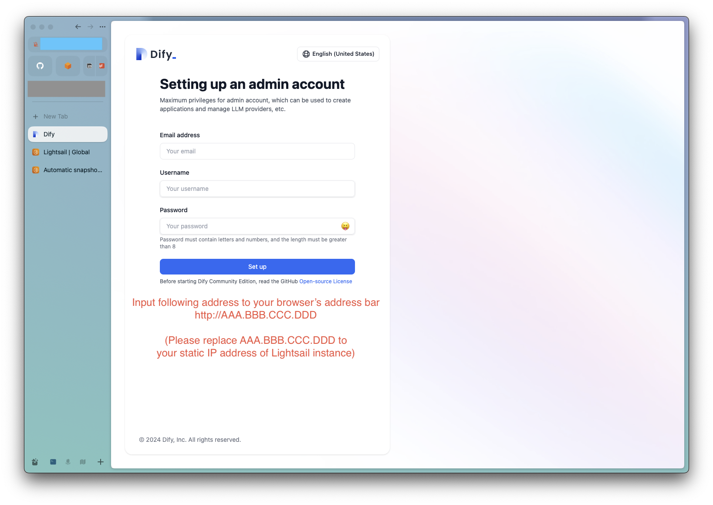

### How to Delete Deployed Stack?

1. Open CloudFormation Page


2. Delete Stack named `DifyOnLightsail-stack`

The first deletion operation may fail (the IP address is deleted, but the Lightsail instance remains). If this happens, please try the deletion operation again.


